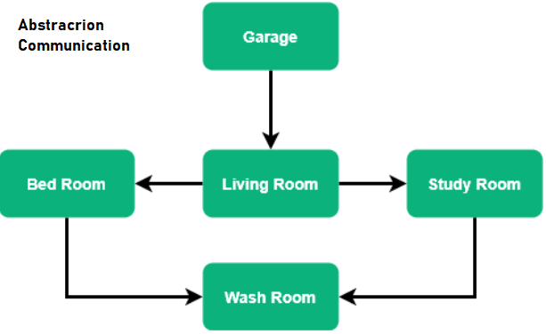
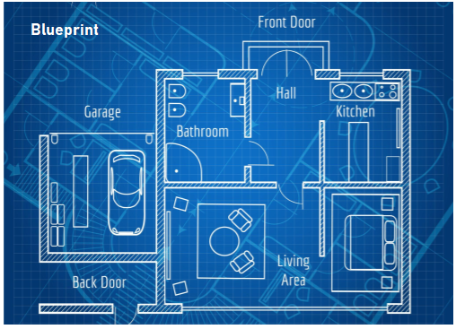

# How to become an an architect
To become a software architect, here are some general steps you can take:

1. **Earn a degree in computer science or a related field:** Most software architects have a bachelor's or master's degree in computer science, software engineering, or a related field.

2. **Gain practical experience in software development:** To become a software architect, it's important to have experience in software development. This can be gained through internships, entry-level positions, or personal projects.

3. **Develop expertise in specific technologies:** Software architects should have expertise in specific programming languages, tools, and technologies. This can be gained through work experience, self-study, or certifications.

4. **Build knowledge of architecture and design patterns:** Software architects should have a strong understanding of software architecture and design patterns. This can be gained through education, work experience, or self-study.

5. **Develop communication and leadership skills:** Software architects need to work closely with developers, stakeholders, and other architects, so strong communication and leadership skills are essential.

6. **Consider certifications:** There are various certifications available for software architects, such as the AWS Certified Solutions Architect or Microsoft Certified: Azure Solutions Architect Expert. These certifications can demonstrate expertise in specific technologies or platforms.

It's important to note that becoming a software architect typically requires years of experience in software development and a strong understanding of software architecture and design patterns. It's also a good idea to stay up-to-date with new technologies and industry trends to ensure that your skills remain relevant.

## What is an Architecture?
### Definition
* Architecture serves as a **blueprint** for a system. 
* It provides an **abstraction** to manage the system complexity 
* and establish a **communication** among components.

* Software architecture refers to the overall structure and organization of a software system, including its components, their relationships, and the principles that govern their design and evolution.

* Software architecture provides a high-level view of the system that guides the development of individual components and their interactions. It involves making critical decisions that affect the entire system, such as choosing the programming language, frameworks, and infrastructure, as well as defining the system's interfaces, data flows, and communication protocols.

* Good software architecture should provide a clear understanding of the system's functionality, scalability, maintainability, and security. It should also be flexible enough to accommodate changes and updates over time.

* The process of creating a software architecture involves analyzing the requirements of the system, identifying the key components and their relationships, and designing the interfaces and interactions between them. This process requires a combination of technical knowledge, problem-solving skills, and creativity.

* Software architecture is a critical aspect of software development because it determines the overall quality and success of the system. A well-designed architecture can reduce development time, improve maintainability, and enhance the system's performance, while a poorly designed architecture can lead to technical debt, performance issues, and other problems that can be difficult to fix.

### IEEE:
The process of defining a collection of hardware and software components

and their interfaces to establish the framework for the development of a computer system

### Grady Booch
Architecture represents the significant **design decisions** that shape a system, where significant is measured by **cost of change**

### Mazhar:
Architecture is a **high** level Design

## What is the difference between Software Architecture and Design?
Software architecture and design are related concepts but they have different focuses and objectives.

### Software Architecture 
is the overall structure and organization of a software system, including the high-level components, their interactions, and the principles that govern their design and evolution. It describes the fundamental decisions that are made early in the software development process, such as the choice of programming languages, frameworks, and infrastructure. Software architecture addresses the concerns of scalability, reliability, maintainability, and security.

### Software Design, 
on the other hand, is the process of defining the detailed structure and behavior of the individual components of a software system, such as classes, objects, and functions. It is concerned with the implementation of specific features and functionalities, and it typically involves creating detailed diagrams, models, and prototypes. Software design addresses the concerns of usability, performance, and functionality.

In summary, software architecture is concerned with the overall structure and organization of a software system, while software design is concerned with the detailed implementation of its individual components. Software architecture is typically done at a higher level of abstraction than software design, and it focuses on the big picture rather than the details. Both software architecture and design are important for creating software systems that are scalable, reliable, maintainable, and secure.

## Who is an Architect?
First of all an Architect is someone who has high proficency in his domain(Language and its Ecosystem). An experinced software engineer who knows about his tools and technologies.
-- to be continued --

* A person who has an eye on high level design

* A person who can forsee and predic future design need

* A person who makes decisions which are difficult to change in the future

## Software Architect
Unlike building's Architect, he must know all the tools, and have practicle experince of those tools
Lets assume an exmple where the Java and ecosystems is targeted (Generally an architect have experince of more than one ecosytems).

## Responsibilities of a software architect

The responsibilities of a software architect can vary depending on the organization and the specific project, but here are some common responsibilities:

1. **Design the system architecture:** The software architect is responsible for designing the overall structure of the software system, including its components, their interactions, and the principles that govern their design and evolution.

2. **Define technical requirements:** The software architect must work with stakeholders to identify the technical requirements of the system, such as performance, scalability, and security, and ensure that they are reflected in the architecture.

3. **Make critical decisions:** The software architect is responsible for making critical technical decisions that affect the entire system, such as selecting the programming language, frameworks, and infrastructure.

4. **Create technical documentation:** The software architect must create technical documentation that explains the architecture and design of the system to developers, stakeholders, and other team members.

5. **Guide development teams:** The software architect must provide guidance and support to development teams to ensure that the system is developed in accordance with the architecture and design.

6. **Evaluate and select third-party components:** The software architect must evaluate and select third-party components, such as libraries and frameworks, that are necessary for the system and ensure that they are compatible with the architecture.

7. **Ensure the system meets quality standards:** The software architect must ensure that the system meets quality standards, such as performance, scalability, maintainability, and security, and make adjustments to the architecture and design as necessary.

8. **Stay up-to-date with industry trends:** The software architect must stay up-to-date with the latest industry trends, such as new technologies and software development methodologies, and ensure that the system is designed with these trends in mind.

Overall, the software architect is responsible for ensuring that the software system is designed and developed in a way that meets the needs of the organization and its stakeholders, while also adhering to technical and quality standards.

## Tools of an Architect
* Java - high proficeny of the language itself, can you write any code without looking up on stackoverflow? (Steams API, Conversion of Object array to ArrayList and vice versa)
* Design Patterns - SOLID, DRY, and many ohters

Software architects use a variety of tools to perform their duties. Here are some common tools that a software architect may use:

1. **Diagramming tools:** Diagramming tools such as Visio or Draw.io can be used to create visual representations of the software architecture, such as UML diagrams or flowcharts.

2. **Code editors and IDEs:** Code editors and Integrated Development Environments (IDEs) are used to write and edit code for the software system. Examples include Visual Studio, IntelliJ IDEA, and Eclipse.

3. **Version control systems:** Version control systems such as Git or SVN are used to track changes to the software code and ensure that multiple developers can work on the codebase simultaneously.

4. **Project management tools:** Project management tools such as Jira or Trello can be used to track tasks, bugs, and feature requests related to the software architecture.

5. **Collaboration tools:** Collaboration tools such as Slack or Microsoft Teams can be used to facilitate communication and collaboration among members of the software development team.

6. **Testing and quality assurance tools:** Testing and quality assurance tools such as JUnit or Selenium can be used to test the software system and ensure that it meets the required quality standards.

7. **Cloud infrastructure tools:** Cloud infrastructure tools such as AWS or Azure can be used to provision and manage the cloud infrastructure required for the software system.

8. **Monitoring and logging tools:** Monitoring and logging tools such as New Relic or Loggly can be used to monitor the performance and health of the software system in production.

Overall, the tools used by a software architect will depend on the organization, project, and specific requirements of the software system.

-- to be continued --

## Types of Architect
* Software Architect
* Solution Architect
* Enterprise Architect
* QA Architect
* Mobile Architect
* DevOps Architect
* Data Architect

### Software Architect: 
A software architect is responsible for designing and developing software solutions to meet business needs. They create high-level designs and architectures for software systems, ensuring that the design aligns with business requirements, and also evaluate technologies and tools to ensure that the software is scalable, secure, and maintainable.

### Solution Architect: 
A solution architect is responsible for designing end-to-end solutions for specific business problems or projects. They work closely with stakeholders, developers, and other architects to ensure that the solution meets the requirements and is scalable, secure, and maintainable. They also ensure that the solution aligns with the organization's overall architecture strategy.

### Enterprise Architect: 
An enterprise architect is responsible for designing and managing an organization's overall architecture strategy. They ensure that the organization's technology, processes, and systems align with its business goals and objectives. They work closely with stakeholders across the organization to ensure that the architecture supports the organization's needs.

### QA Architect: 
A QA architect is responsible for designing and implementing the testing strategy for software systems. They work closely with developers to ensure that software is tested thoroughly and meets quality standards. They also evaluate and implement testing tools and methodologies to ensure that testing is efficient and effective.

### Mobile Architect: 
A mobile architect is responsible for designing and developing mobile applications for different platforms. They ensure that the application is scalable, secure, and user-friendly. They also evaluate and implement mobile development technologies and tools to ensure that the application is efficient and effective.

### DevOps Architect: 
A DevOps architect is responsible for designing and implementing DevOps processes and practices to ensure that software is developed, tested, and deployed quickly and reliably. They work closely with developers, operations, and other stakeholders to ensure that the DevOps process is efficient and effective.

### Data Architect: 
A data architect is responsible for designing and managing an organization's data architecture. They ensure that data is collected, stored, and managed efficiently and effectively. They also work closely with stakeholders to ensure that data is aligned with the organization's overall architecture strategy and supports its business goals and objectives.

### Differnce between Solution Architect and DevOps Architect
* A solution architect and a DevOps architect have different responsibilities and focus areas.

* A solution architect is responsible for designing end-to-end solutions for specific business problems or projects. They work closely with stakeholders, developers, and other architects to ensure that the solution meets the requirements and is scalable, secure, and maintainable. They focus on the overall design and architecture of the solution, including its technology, data, and security aspects.

* On the other hand, a DevOps architect is responsible for designing and implementing DevOps processes and practices to ensure that software is developed, tested, and deployed quickly and reliably. They work closely with developers, operations, and other stakeholders to ensure that the DevOps process is efficient and effective. They focus on the automation of the software development process, including continuous integration and deployment, infrastructure as code, and monitoring and logging.

> In summary, a solution architect focuses on the design and architecture of software solutions, while a DevOps architect focuses on the automation and optimization of the software development process.

## Career Path
* Software Engineer
* Senior Software Engineer
* Principal Software Engineer
* Associate Architect
* Architect
* Senior Architect
* Principal Architect
* Chief Architect
* Chief Scientist/CTO

## Scenerios
[5 Scenerios](architects/five-architecure-scenerios.md)

## How to stay upto date
As a software architect, it's important to stay up-to-date with the latest trends, technologies, and best practices in the field. Here are some channels, websites, podcasts, and other resources that can help you stay informed:

* TechCrunch: TechCrunch is a leading technology news website that covers the latest trends and developments in the tech industry, including software development and architecture.

* Hacker News: Hacker News is a social news website that features stories and discussions on a wide range of topics related to technology, software development, and architecture.

* Software Engineering Radio: Software Engineering Radio is a podcast that features interviews and discussions with experts in the field of software engineering, including software architecture.

* Software Architecture Summit: The Software Architecture Summit is a conference that brings together experts in the field of software architecture to share their insights and experiences.

* InfoQ: InfoQ is a website that provides news, articles, and videos on a wide range of topics related to software development and architecture.

* O'Reilly: O'Reilly is a publishing company that produces books, online courses, and conferences on a wide range of topics related to software development and architecture.

* IEEE Software: IEEE Software is a peer-reviewed journal that publishes articles and research papers on a wide range of topics related to software engineering, including software architecture.

* DevOps.com: DevOps.com is a website that provides news, articles, and videos on a wide range of topics related to DevOps, software development, and architecture.

By following these channels, websites, podcasts, and other resources, you can stay up-to-date with the latest trends, technologies, and best practices in software architecture and related fields.

## Books & Contetns
* [Books & Contents](architects/architects-books.md)
* [Backend Interview Questions](backend-interview-topics.md)
